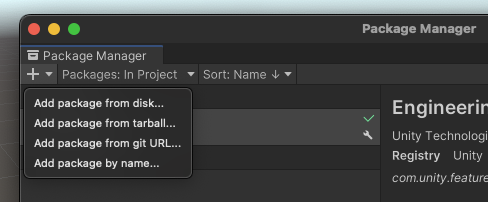
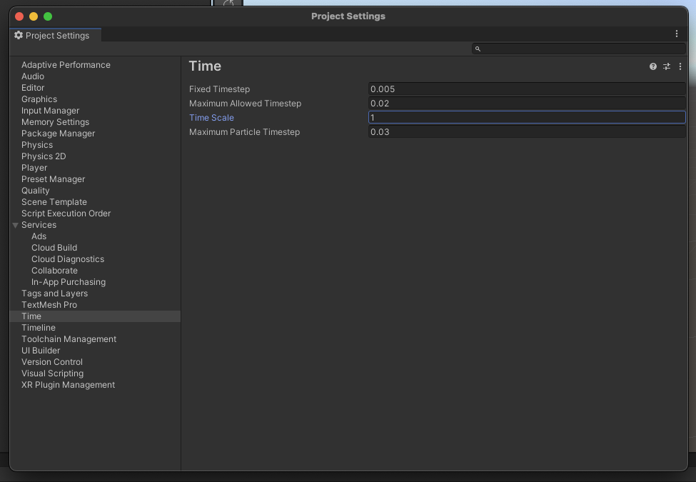
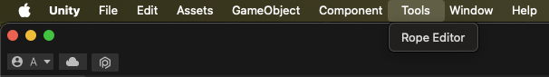
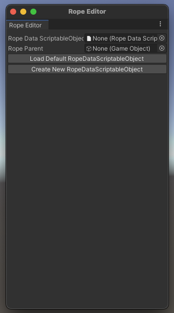

# Rope Generator Unity Package

## Description

The **Rope Generator** is a Unity package designed to simplify the creation of dynamic ropes in Unity projects. This package allows you to easily generate customizable ropes with adjustable width, length, and material in both Edit Mode and Play Mode.

### Key Features

- **Customizable Ropes:** Adjust width, length, and material to fit your project's needs.
- **Editor Integration:** Use the provided editor window to set parameters, generate ropes, and control physics simulations directly within Unity.
- **Dynamic Physics:** Ropes are composed of interconnected "rope segments" using Unity's `CharacterJoint` components, ensuring realistic physics behavior (e.g., rope bending and collision).

## Installation

### Method 1: Import from GitHub (Recommended)

1. Copy the following URL 
`https://github.com/AbolfazlHo/rope-generator.git?path=/Assets/ir.soor.rope-generator`

2. Open your Unity project.
3. In Unity Editor, navigate to **Window > Package Manager**.

    
4. Click the **+** icon in the top-left corner of the Package Manager and select **"Add package from Git URL"**.
5. Paste the copied URL and click **"Add"**.

    

Unity will download and install the package and its dependencies.

**Watch the installation process on** [YouTube](https://youtu.be/W2dF7CE32oY)

### Method 2: Import from Unity Asset Store (It's not available yet)

1. Open your Unity project.
2. Go to [Unity Asset Store](https://assetstore.unity.com/) and search for "Character Joint Based Rope Generator."
    
3. Click **"Add to Cart"**, then select **"Open in Unity"** when prompted.
    
4. Unity will open the Package Manager and display the package. Click **"Download and Install"**.
<!--
**Watch the Asset Store installation process on YouTube:** [Link to YouTube video]
-->

## Setup Before Use

Before using the package, update Unity's time settings:

1. Navigate to **Edit > Project Settings > Time**.
2. Adjust the parameters as shown:

    

**Watch the setup process on** [YouTube](https://youtu.be/_cYPLn0BSZs)

## How to Use the Package

### In Edit Mode

1. After installation, you'll find a new menu item: **Tools > Rope Editor**.
2. Open the **Rope Editor** window to configure parameters and generate ropes.

    
    
    

**Watch the usage guide for Edit Mode** [ here ](https://youtu.be/VUtRpSNXcN4) or [ here ](https://youtu.be/b6mohiijjOk)

### In Play Mode

You can dynamically generate ropes in Play Mode by creating an instance of the Rope class and call the `SpawnRope()` method within your scripts.

**Watch the Play Mode usage guide on** [Youtube](https://youtu.be/YOJNTRXfb9g)

## Contribution

Contributions are welcome!

- Fork the `main` branch, make your changes, and submit a pull request.
- Share your feedback or record videos showcasing your use of the package.

## Special Thanks

Special thanks to the [Smon YouTube Channel](https://www.youtube.com/watch?v=pKSUhsyrj_4), whose tutorial inspired the development of this package.

## License

This project is licensed under the MIT License.

